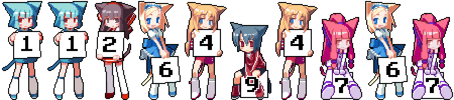

<div align="center">
  
  <br>
  
# 拷贝漫画 · HarmonyOS 客户端
**有什么好的想法或者bug直接提issue或者填收集表 https://docs.qq.com/form/page/DYkdXcUxYamZyV0dT 或者进群反馈都可以的**
用 ArkTS / ArkUI 写的原生鸿蒙漫画阅读客户端，适配 HarmonyOS 手机与平板（API 26）。

界面完全原生：不是 WebView 套壳，翻页、滚动、材质、深浅色都走系统能力。顶部标题栏使用 HarmonyOS Design 的系统材质（`systemMaterialEffect`），内容滚到栏下时会浮现系统级的光感模糊，并且内容从一开始就顶到状态栏，全程沉浸式。

> 本项目是非官方第三方客户端，与站点方无关，仅用于学习和个人使用；漫画内容与版权归原站及作者所有。

<div align="center">
  
  <br>
  交流群：<b>1126494767</b>
</div>

## 功能

**发现**
- 首页：轮播、编辑推荐、免费 / 收费 / 动画 周榜、免费 / 收费 / 动画 更新、专题聚合
- 排行榜：日榜 / 周榜 / 月榜 × 少年 / 少女
- 分类浏览：72 个题材 + 「最近更新 / 最热」排序
- 搜索：综合 / 名称 / 作者三种检索，热门题材入口，搜索历史

**阅读**
- 详情页：封面、作者、题材标签、简介、章节列表（含单行本 / 特典分组）、订阅、继续阅读
- 阅读器：竖排连续滚动与横向翻页两种模式、图片间距三档、章节内目录、上一话 / 下一话、本章评论
- 阅读进度按话记忆，回来接着看

**书架与账号**
- 书架：本地订阅与阅读历史，可清空历史
- 登录后可看云端订阅与云端历史，跨设备同步
- 账号密码只用于换取令牌，不落盘

**外观**
- 主题：跟随系统 / 浅色 / 深色，切换即时生效
- 沉浸光感：跟随系统 / 强 / 均衡 / 弱四档，控制顶栏与页签的玻璃材质强度
- 材质能力诊断：设备是否支持系统材质、当前生效档位一目了然

**网络**
- 主机池：多线路自动探测与切换，某条线路不可用时自动换
- 应用内 HTTP 代理：可手动填代理地址（留空则跟随系统代理），影响接口与图片加载
- 接口状态页：逐条列出当前可用主机及探测结果

## 界面

- 顶栏：HarmonyOS Design Kit 的标题栏组件，与首页、二级页共用同一份材质参数
- 底部页签：首页 / 排行 / 搜索 / 书架 / 我的，页签栏同样是系统材质
- 二级页：列表、详情、阅读、登录、设置，全部沉浸式布局 —— 内容顶到状态栏边缘，靠安全区"让位"保证标题不被遮挡
- 深色模式独立配色，浅色 / 深色两套色板分别维护

## 技术栈

| 项目 | 说明 |
| --- | --- |
| 语言 | ArkTS，Stage 模型 |
| UI | ArkUI 声明式（`NavDestination` / `Grid` / `List` / `LazyForEach`） |
| 设计系统 | HarmonyOS Design Kit（`@kit.UIDesignKit`）的 `HdsNavigation` / `HdsNavDestination` |
| 窗口 | 沉浸式窗口、安全区扩展、系统材质与主题跟随 |
| 构建 | hvigor + DevEco Studio 26.0，`compatibleSdkVersion` / `targetSdkVersion` = 26.0.0 |
| 权限 | `ohos.permission.INTERNET`、`ohos.permission.GET_NETWORK_INFO` |
| 设备 | phone、tablet |

## 目录结构

```
copymanga-harmony/
├── AppScope/                      应用级配置与图标
├── entry/
│   ├── src/main/
│   │   ├── ets/
│   │   │   ├── api/               接口定义、请求头、主机池
│   │   │   ├── common/            HTTP、日志、偏好存储、尺寸常量、窗口与材质
│   │   │   ├── components/        列表卡片、状态页、筛选胶囊、评论列表
│   │   │   ├── entryability/      入口 Ability
│   │   │   ├── model/             数据模型与首页分区解析
│   │   │   ├── navigation/        路由表
│   │   │   ├── pages/             底部页签容器
│   │   │   ├── screens/           首页 / 排行 / 搜索 / 书架 / 我的 / 详情 / 阅读 / 登录 / 设置
│   │   │   └── state/             全局状态、数据源、本地书架
│   │   ├── resources/             字符串、颜色（浅色 / 深色两套）、图标
│   │   └── module.json5           模块与权限声明
│   └── build-profile.json5
├── build-profile.json5            应用级构建配置（SDK 版本、产品）
├── docs/                          README 用素材（交流群号动图）
└── oh-package.json5
```

## 构建

环境要求：

- DevEco Studio 26.0 及以上（SDK：HarmonyOS API 26 / 26.0.0）
- 命令行构建需要 `hvigorw`（DevEco 自带）

用 DevEco Studio 打开工程目录，等待 Sync 完成后点 Run 即可。

命令行构建 HAP：

```bash
hvigorw --mode module -p product=default -p module=entry@default assembleHap --no-daemon
```

产物在 `entry/build/default/outputs/default/` 下。

关于签名：工程里 `signingConfigs` 默认为空，因此命令行产出的是未签名包（`entry-default-unsigned.hap`），可先装到模拟器上验证；要装真机，请在 DevEco Studio 的 **File → Project Structure → Signing Configs** 里勾选自动生成签名，DevEco 会把配置写回 `build-profile.json5`。

安装到已连接设备：

```bash
hdc install -r entry/build/default/outputs/default/entry-default-signed.hap
```

## 已知限制

- 只有手机 / 平板两种设备形态，未适配 PC 与折叠屏的分栏布局
- 不提供离线下载与本地漫画缓存，阅读依赖网络
- 云端订阅 / 云端历史需要登录站点账号
- 阅读页顶栏是"点一下才浮现"的浮层，不是常驻标题栏
- 接口主机由客户端自行探测，首次进入某些页面需要短暂等待

## 免责声明

本项目为第三方非官方客户端，与站点运营方没有任何关系，仅供学习交流与个人使用，请勿用于商业用途。应用内展示的所有漫画内容、图片与商标均归原始权利人及站点所有。
